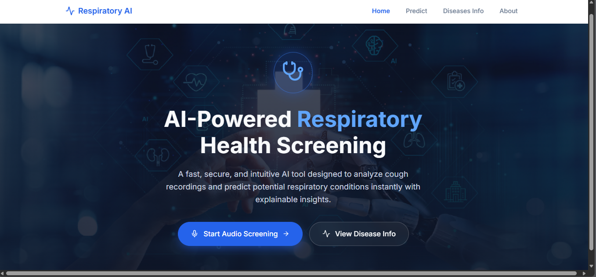
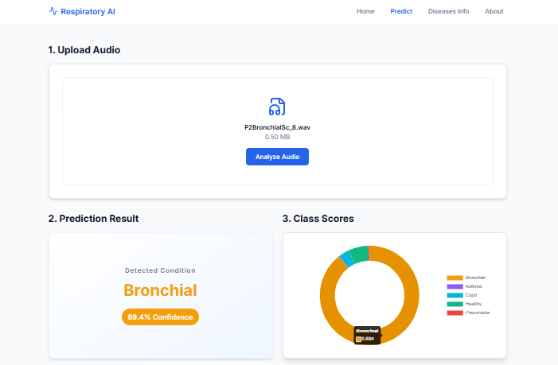

# Respiratory Illness Screening via Cough Audio Analysis Using Deep Learning

An AI-powered, non-invasive health screening tool designed to analyze cough and respiratory recordings to predict potential respiratory conditions instantly with explainable insights. This system utilizes a hybrid deep learning architecture alongside Explainable AI (XAI) to ensure clinical transparency.

---

## 📌 Problem Statement
Respiratory illnesses pose a significant global health risk and contribute to economic strain, especially in resource-limited areas. Traditional diagnostic methods are often invasive and resource-intensive. While AI-based systems show promise, they frequently suffer from narrow diagnostic scopes, varying performance, and vulnerability to real-world audio noise. 

This project addresses these challenges by delivering a single, robust, and versatile deep learning model capable of accurately diagnosing a wide range of respiratory illnesses from diverse, real-time audio samples.

---

## 🚀 Objectives
* **Hybrid Architecture Design:** Develop a CNN–BiLSTM model capturing both spectral patterns (spatial) and temporal dependencies (time-series) in respiratory sounds.
* **Dual-Feature Extraction:** Implement a processing pipeline extracting Mel-Frequency Cepstral Coefficients (MFCC) and Mel-spectrograms.
* **Multiclass Classification:** Categorize audio samples into 5 clinical classes: Asthma, Bronchial conditions, COPD, Pneumonia, and Healthy cases.
* **Explainable AI (XAI) Integration:** Use Guided Grad-CAM heatmaps to visualize time-frequency regions influencing predictions.
* **Real-Time Optimization:** Maintain a lightweight architecture (~77 MB) for edge device optimization.

---

## 🛠️ Proposed System Architecture

### 1. Preprocessing & Feature Extraction
The pipeline accepts raw audio files (`.wav` or `.mp3`). The signal undergoes standard preprocessing (normalization, noise removal, resampling) and is padded or truncated to a fixed sequence of 100 frames. 

The system runs a **Dual-Feature Pipeline** extracting parallel representations:
* **Mel-spectrograms:** Maps frequencies to the Mel-scale to pinpoint energy patterns over time (e.g., identifying localized wheezes or crackles).
* **MFCCs:** Captures the spectral envelope and key core acoustic properties.

```
[Raw Audio File] ➡️ [Noise Removal & Normalization]
                           ⬇️
            ┌──────────────┴──────────────┐
            ▼                             ▼
   [MFCC Extraction]             [Mel-Spectrogram]
      (40 * 100)                    (128 * 100)
            │                             │
            └──────────────┬──────────────┘
                           ▼
              [Feature Input for Model]
```

### 2. Hybrid Learning Model (CNN-BiLSTM)
* **Dual-Branch CNN:** Separately processes the feature arrays to automatically extract spatial and spectral pattern textures.
* **BiLSTM Layer:** Reads sequences bidirectionally to provide full clinical context over a complete respiratory cycle.
* **Feature Fusion:** Merges feature arrays into a `Combined Feature Vector` before passing them to the final classification layer for multi-class diagnostic output.

---

## 💻 System Implementation & Interface

### Diagnostics Dashboard
The home interface allows users to easily upload audio files into the secure AI inference engine.


### Model Pipeline Flowchart
The system flow chart detailing feature extraction, spatial map alignment, and inference generation:


### Result Interpretation & Metrics Breakdown
The prediction system delivers clear, actionable diagnostic classification accompanied by explicit confidence metrics for transparency.



### Explainable AI Visualization
By utilizing **Guided Grad-CAM**, gradients are backpropagated to the final convolutional layers to isolate specific spectro-temporal regions influencing the diagnosis. This confirms that the model focuses on vital clinical sound patterns rather than ambient background noise.
* *Asthma & COPD:* High-energy regions map directly to wheezing frequency bands.
* *Pneumonia:* Concentrates on lower-frequency segments.


### Educational Disease Layer
An informative dashboard providing medical context, symptoms, and potential severity definitions for users interpreting their results.


---

## 📈 Performance Evaluation

The system was evaluated using stratified patient-wise 5-fold cross-validation to guarantee generalization on new clinical data rather than learning individual voice characteristics.

* **Overall Validation Accuracy:** 94.2%
* **Class Separability (ROC AUC):** * COPD: 1.00
    * Healthy: 0.99
    * Asthma & Pneumonia: 0.98

## 👥 Project Team
* **Students:** G. Ashrith & S. Sravan
* **Department:** Computer Science and Engineering (AI & ML)
* **Institution:** CMR College of Engineering & Technology, Hyderabad
